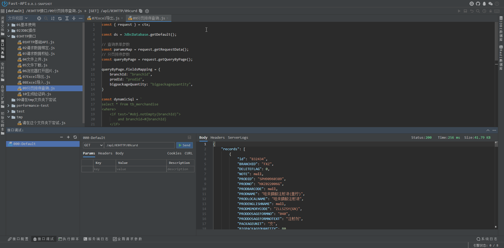
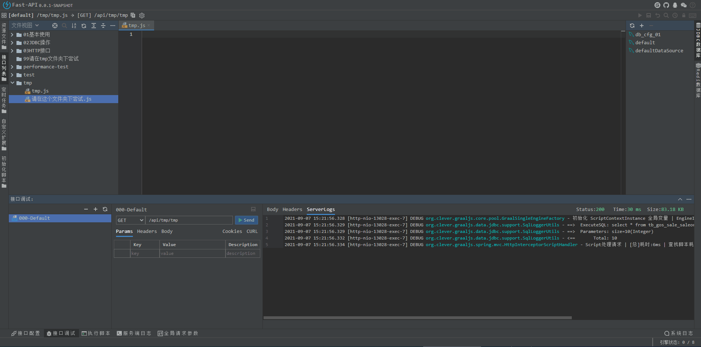
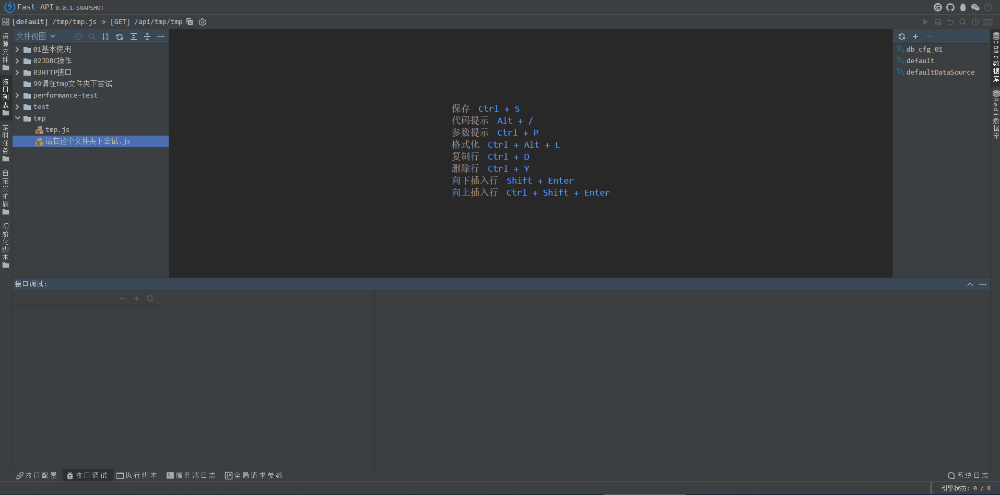
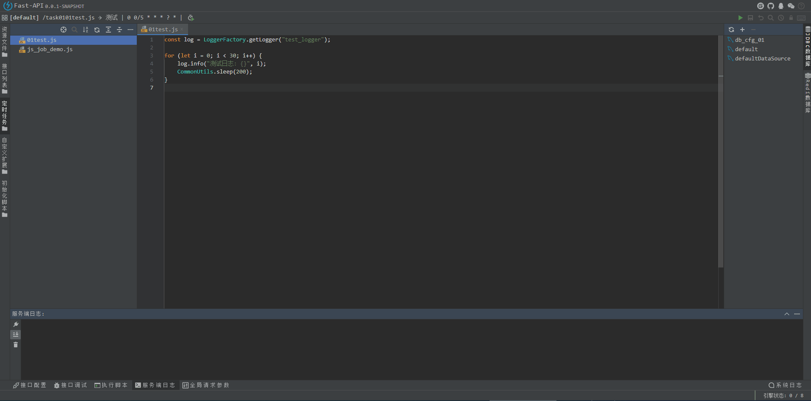

    

    
    
    

# clever-graaljs 简介

clever-graaljs是基于 [graaljs](https://github.com/oracle/graaljs) 的高性能js脚本引擎，适合各种需要及时修改代码且立即生效的场景，如：ETL工具、动态定时任务、接口平台、工作流执行逻辑。

[fast-api](https://gitee.com/LiZhiW/clever-graaljs/tree/main/clever-graaljs-fast-api) 就是基于clever-graaljs开发的接口平台，可以直接写js脚本开发Http接口，简单快速！

### 特性

- 支持jdbc规范的数据库，如：MySQL、Oracle、PostgreSQL、SQLServer 等
- 支持自定义扩展(注入自定义业务对象)
- 支持Redis数据库
- 内置各种常用的API，丰富又简单好用
- 支持多数据源，支持事务，支持与Spring相同的事务嵌套逻辑
- 支持mybatis方式的动态sql
- 支持文件上传下载，Excel导入导出，图片输出等
- 支持定时任务、初始化执行脚本
- 提供功能强大的WebIDE，代码智能提示、格式化、接口调试、服务端日志查看等功能

### 演示

- 在线演示：[http://dev.hinny.top:13028/fast-api.html](http://dev.hinny.top:13028/fast-api.html)
- 项目示例：[fast-api-demo](https://gitee.com/LiZhiW/clever-graaljs/tree/main/clever-graaljs-fast-api-demo)

### 项目截图

### 感谢JetBrains Open Source license(s)

 

[JetBrains Open Source license(s)](https://www.jetbrains.com/?from=clever-nashorn)
